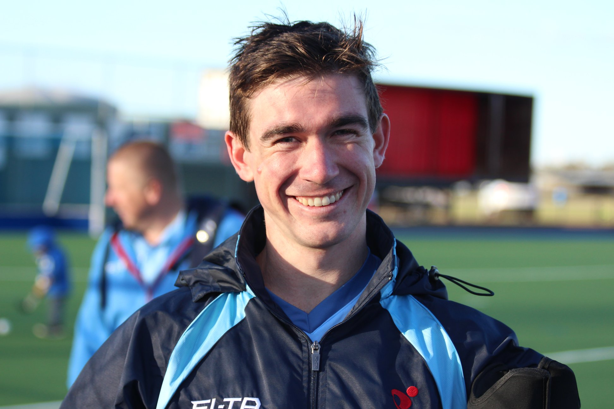

# **Home**

I am a PhD candidate in the Cognition Lab at the University of Newcastle, Australia. I study cognitive workload, performance, and decision making of individuals working in small collaborative and competitive groups. 

I use Python, Matlab, and R to develop mathematical tools and models to diagnose changes in the processing structure and efficiency of individual cognitive systems. I have also developed teaching materials for undergraduate students that include simple javascript cognitive psychgolgy experiments from visual search to reasoning tasks.

This site hosts and links academic materials and projects that I have contriubuted to or developed. To get in contact please email via murray.bennett@uon.edu.au.

For full documentation visit [mkdocs.org](https://www.mkdocs.org).

## Commands

* `mkdocs new [dir-name]` - Create a new project.
* `mkdocs serve` - Start the live-reloading docs server.
* `mkdocs build` - Build the documentation site.
* `mkdocs -h` - Print help message and exit.

## Project layout

    mkdocs.yml    # The configuration file.
    docs/
        index.md  # The documentation homepage.
        ...       # Other markdown pages, images and other files.
